<p align="center">
  
</p>

<p align="center">
  
  
  
  
  
  
</p>

<p align="center">
  <a href="https://sonora-api.vextalor49-a5d.workers.dev"></a>
</p>

<p align="center" style="max-width:700px; margin:20px auto 0; color:#94a3b8; font-family:'Segoe UI',sans-serif; line-height:1.7;">
Most "self-hosted" music setups demand a rented VPS, a media container, and a weekend of YAML.<br>
<strong style="color:#c4b5fd;">Sonora runs entirely on Cloudflare Workers</strong> — free tier, global edge, nothing to babysit — and ships a real <strong style="color:#c4b5fd;">Android app with native lockscreen controls</strong>, produced by GitHub Actions on every push.
</p>

<br>

<!-- ────────────────────── STAT STRIP ────────────────────── -->

<table align="center" border="0" cellpadding="0" cellspacing="10" style="max-width:980px; width:100%;">
<tr>
  <td align="center" style="background:#0f0f1a; border:1px solid #2d2d44; border-radius:14px; padding:18px 10px; width:25%;">
    <div style="font-family:'Segoe UI',sans-serif; font-size:28px; font-weight:700; color:#a78bfa;">$0</div>
    <div style="color:#64748b; font-size:12px; margin-top:4px; letter-spacing:0.5px; font-family:'Segoe UI',sans-serif;">server bill &middot; free tier</div>
  </td>
  <td align="center" style="background:#0f0f1a; border:1px solid #2d2d44; border-radius:14px; padding:18px 10px; width:25%;">
    <div style="font-family:'Segoe UI',sans-serif; font-size:28px; font-weight:700; color:#f472b6;">2m 12s</div>
    <div style="color:#64748b; font-size:12px; margin-top:4px; letter-spacing:0.5px; font-family:'Segoe UI',sans-serif;">push &rarr; installable APK</div>
  </td>
  <td align="center" style="background:#0f0f1a; border:1px solid #2d2d44; border-radius:14px; padding:18px 10px; width:25%;">
    <div style="font-family:'Segoe UI',sans-serif; font-size:28px; font-weight:700; color:#38bdf8;">300+</div>
    <div style="color:#64748b; font-size:12px; margin-top:4px; letter-spacing:0.5px; font-family:'Segoe UI',sans-serif;">edge cities serve your audio</div>
  </td>
  <td align="center" style="background:#0f0f1a; border:1px solid #2d2d44; border-radius:14px; padding:18px 10px; width:25%;">
    <div style="font-family:'Segoe UI',sans-serif; font-size:28px; font-weight:700; color:#34d399;">1 tap</div>
    <div style="color:#64748b; font-size:12px; margin-top:4px; letter-spacing:0.5px; font-family:'Segoe UI',sans-serif;">from page to lockscreen</div>
  </td>
</tr>
</table>

<br>

---

<br>

<!-- ────────────────────── HIGHLIGHTS ────────────────────── -->

<h2 align="center">
  <span style="color:#a78bfa;">Highlights</span>
</h2>

<table align="center" border="0" cellpadding="0" cellspacing="8" style="max-width:980px; width:100%;">
<tr>
  <td style="background:#0f0f1a; border:1px solid #1e1e3a; border-radius:14px; padding:22px 24px; width:33.3%; vertical-align:top;">
    <div style="font-family:'Segoe UI',sans-serif; font-size:11px; font-weight:600; letter-spacing:2.5px; color:#8b5cf6; margin-bottom:8px;">EDGE-NATIVE API</div>
    <div style="color:#94a3b8; font-size:14px; line-height:1.6; font-family:'Segoe UI',sans-serif;">Hono on Cloudflare Workers with D1 (SQLite at the edge) and KV media staging. Deploys in seconds, scales to zero, costs nothing.</div>
  </td>
  <td style="background:#0f0f1a; border:1px solid #1e1e3a; border-radius:14px; padding:22px 24px; width:33.3%; vertical-align:top;">
    <div style="font-family:'Segoe UI',sans-serif; font-size:11px; font-weight:600; letter-spacing:2.5px; color:#f472b6; margin-bottom:8px;">LIVE STREAMING</div>
    <div style="color:#94a3b8; font-size:14px; line-height:1.6; font-family:'Segoe UI',sans-serif;">Chunked playback with HTTP Range support and in-memory seeking. Instant scrubbing, zero buffering tricks, true streaming from day one.</div>
  </td>
  <td style="background:#0f0f1a; border:1px solid #1e1e3a; border-radius:14px; padding:22px 24px; width:33.3%; vertical-align:top;">
    <div style="font-family:'Segoe UI',sans-serif; font-size:11px; font-weight:600; letter-spacing:2.5px; color:#38bdf8; margin-bottom:8px;">GLASSMORPHIC UI</div>
    <div style="color:#94a3b8; font-size:14px; line-height:1.6; font-family:'Segoe UI',sans-serif;">React 18 + Tailwind v4 on a violet-on-black canvas. Blur panels, floating now-playing bar, responsive from desktop to the smallest phone.</div>
  </td>
</tr>
<tr>
  <td style="background:#0f0f1a; border:1px solid #1e1e3a; border-radius:14px; padding:22px 24px; width:33.3%; vertical-align:top;">
    <div style="font-family:'Segoe UI',sans-serif; font-size:11px; font-weight:600; letter-spacing:2.5px; color:#34d399; margin-bottom:8px;">NATIVE ANDROID</div>
    <div style="color:#94a3b8; font-size:14px; line-height:1.6; font-family:'Segoe UI',sans-serif;">Capacitor 7 shell with a custom MediaSession plugin. Lockscreen artwork, transport buttons, seek bar, foreground service with notification controls.</div>
  </td>
  <td style="background:#0f0f1a; border:1px solid #1e1e3a; border-radius:14px; padding:22px 24px; width:33.3%; vertical-align:top;">
    <div style="font-family:'Segoe UI',sans-serif; font-size:11px; font-weight:600; letter-spacing:2.5px; color:#f59e0b; margin-bottom:8px;">PUSH-BUTTON CI</div>
    <div style="color:#94a3b8; font-size:14px; line-height:1.6; font-family:'Segoe UI',sans-serif;">Every push compiles the web client, syncs it into the shell, and uploads an app-debug.apk artifact. Permanently signed, installs cleanly over the last.</div>
  </td>
  <td style="background:#0f0f1a; border:1px solid #1e1e3a; border-radius:14px; padding:22px 24px; width:33.3%; vertical-align:top;">
    <div style="font-family:'Segoe UI',sans-serif; font-size:11px; font-weight:600; letter-spacing:2.5px; color:#e879f9; margin-bottom:8px;">SECURITY FIRST</div>
    <div style="color:#94a3b8; font-size:14px; line-height:1.6; font-family:'Segoe UI',sans-serif;">PBKDF2-hashed passwords (WebCrypto), HS256 JWTs, role-based access. First account to register automatically becomes admin.</div>
  </td>
</tr>
</table>

<br>

---

<br>

<!-- ────────────────────── ARCHITECTURE ────────────────────── -->

<h2 align="center">
  <span style="color:#38bdf8;">Architecture</span>
</h2>

```
┌─────────────────────────────────────────────────────────────────────────┐
│                               Clients                                    │
│                                                                          │
│   ┌────────────────────┐   ┌──────────────────────────────────────────┐ │
│   │  Web (Vite SPA)    │   │  Android (Capacitor 7)                   │ │
│   │  React / Zustand   │   └───────────────┬──────────────────────────┘ │
│   └─────────┬──────────┘                   │ MediaSessionPlugin        │
└─────────────┼──────────────────────────────┼───────────────────────────┘
              │ HTTPS + JWT                  │ (lockscreen / notification)
              ▼                              ▼
┌─────────────────────────────────────────────────────────────────────────┐
│                Cloudflare Workers — Hono API  (cors, auth)              │
│                                                                         │
│   /api/auth      register · login · me · bootstrap                      │
│   /api/songs     browsing, favorites, streaming (Range)                 │
│   /api/library   genres, albums, artists                                │
│   /api/admin     song + artwork upload (KV staging → D1)                │
│   /api/artwork   covers (processed thumbnails)                          │
│                                                                         │
│   ┌─────────────┐        ┌──────────────────┐        ┌──────────────┐  │
│   │  D1 (SQL)   │        │  KV_MEDIA        │        │  Files/R2    │  │
│   │  users,     │        │  audio/art bytes │        │  (optional)  │  │
│   │  songs,     │        │  24h staging TTL │        │  permanent   │  │
│   │  favorites  │        └──────────────────┘        └──────────────┘  │
│   └─────────────┘                                                     │
└─────────────────────────────────────────────────────────────────────────┘
```

<br>

---

<br>

<!-- ────────────────────── GETTING STARTED ────────────────────── -->

<h2 align="center">
  <span style="color:#f59e0b;">Getting started</span>
</h2>

**1 &middot; Deploy the API (Cloudflare Workers)**

```bash
cd workers
npm install

# one-time: create the database and KV namespace
npx wrangler d1 create sonora-db            # copy the database_id into wrangler.jsonc
npx wrangler kv namespace create KV_MEDIA   # copy the id into wrangler.jsonc

# secrets
npx wrangler secret put JWT_SECRET
npx wrangler secret put ADMIN_EMAIL
npx wrangler secret put ADMIN_PASSWORD

# migrate + bootstrap the admin account, then deploy
npm run migrate
curl -X POST $WORKER_URL/api/auth/bootstrap \
  -H 'Content-Type: application/json' \
  -d '{"email":"'$ADMIN_EMAIL'","password":"'$ADMIN_PASSWORD'"}'

npm run deploy
```

> **Tip:** bootstrap disabled? The first account to register becomes ADMIN automatically.

<br>

**2 &middot; Run the web client locally**

```bash
cd frontend
npm install

# point the client at your deployed worker
$env:VITE_API_URL = "https://sonora-api.vextalor49-a5d.workers.dev"   # PowerShell
export VITE_API_URL="https://sonora-api.vextalor49-a5d.workers.dev"   # bash

npm run dev       # http://localhost:5173
npm run build     # typed production build → dist/
```

<br>

**3 &middot; Build the Android app**

GitHub Actions builds and uploads `app-debug.apk` as an artifact on every push to master.
Pull it from the run page and install on any Android 8+ device.

```bash
cd frontend && npm run build
cd ../mobile
npm install @capacitor/core @capacitor/cli @capacitor/android
npx cap add android          # first time only (android/ is committed)
npx cap sync android
cd android && ./gradlew assembleDebug
```

<br>

**4 &middot; Add your music**

```
POST /api/admin/songs          multipart: file + metadata (title, artist, album, genre, artwork)
GET  /api/admin/songs/upload   presigned upload → KV staging, auto-finalized after 24 h
```

<br>

---

<br>

<!-- ────────────────────── API REFERENCE ────────────────────── -->

<h2 align="center">
  <span style="color:#f472b6;">API reference</span>
</h2>

| Method | Route | Description | Auth |
|---|---|---|---|
| `POST` | `/api/auth/register` | Create account (first user → ADMIN) | — |
| `POST` | `/api/auth/login` | Exchange credentials for a JWT | — |
| `POST` | `/api/auth/bootstrap` | Seed admin via secrets | Secret |
| `GET` | `/api/auth/me` | Current user profile | JWT |
| `GET` | `/api/songs` | List songs with filters, pagination | JWT |
| `GET` | `/api/songs/:id/stream` | Chunked audio stream (HTTP Range) | JWT |
| `PUT` | `/api/songs/:id/favorite` | Toggle favorite | JWT |
| `GET` | `/api/library/genres` | Browse genres | JWT |
| `GET` | `/api/library/artists` | Browse artists | JWT |
| `GET` | `/api/library/albums` | Browse albums | JWT |
| `POST` | `/api/admin/songs` | Upload song + artwork | ADMIN |
| `GET` | `/api/artwork/:id` | Cover image (processed thumbnails) | JWT |
| `GET` | `/health` | Liveness probe | — |

<br>

---

<br>

<!-- ────────────────────── TECH STACK ────────────────────── -->

<h2 align="center">
  <span style="color:#34d399;">Tech stack</span>
</h2>

<table align="center" border="0" cellpadding="0" cellspacing="8" style="max-width:940px; width:100%;">
<tr>
  <td style="background:#0f0f1a; border:1px solid #1e1e3a; border-radius:12px; padding:14px 20px; width:50%;">
    <span style="display:inline-block; background:rgba(139,92,246,0.18); border:1px solid rgba(139,92,246,0.35); color:#c4b5fd; border-radius:999px; padding:2px 10px; font-size:11px; font-weight:600; letter-spacing:1.5px; font-family:'Segoe UI',sans-serif;">API</span>
    <span style="color:#94a3b8; font-size:13px; margin-left:8px; font-family:'Segoe UI',sans-serif;">Hono 4 · Cloudflare Workers · D1 · KV · wrangler 3</span>
  </td>
  <td style="background:#0f0f1a; border:1px solid #1e1e3a; border-radius:12px; padding:14px 20px; width:50%;">
    <span style="display:inline-block; background:rgba(56,189,248,0.15); border:1px solid rgba(56,189,248,0.35); color:#7dd3fc; border-radius:999px; padding:2px 10px; font-size:11px; font-weight:600; letter-spacing:1.5px; font-family:'Segoe UI',sans-serif;">WEB</span>
    <span style="color:#94a3b8; font-size:13px; margin-left:8px; font-family:'Segoe UI',sans-serif;">React 18 · Vite 5 · TypeScript · Tailwind v4 · Zustand · Router 6</span>
  </td>
</tr>
<tr>
  <td style="background:#0f0f1a; border:1px solid #1e1e3a; border-radius:12px; padding:14px 20px; width:50%;">
    <span style="display:inline-block; background:rgba(236,72,153,0.15); border:1px solid rgba(236,72,153,0.35); color:#f9a8d4; border-radius:999px; padding:2px 10px; font-size:11px; font-weight:600; letter-spacing:1.5px; font-family:'Segoe UI',sans-serif;">MOBILE</span>
    <span style="color:#94a3b8; font-size:13px; margin-left:8px; font-family:'Segoe UI',sans-serif;">Capacitor 7 · com.sonora.app · custom MediaSession plugin · FGS</span>
  </td>
  <td style="background:#0f0f1a; border:1px solid #1e1e3a; border-radius:12px; padding:14px 20px; width:50%;">
    <span style="display:inline-block; background:rgba(245,158,11,0.15); border:1px solid rgba(245,158,11,0.35); color:#fcd34d; border-radius:999px; padding:2px 10px; font-size:11px; font-weight:600; letter-spacing:1.5px; font-family:'Segoe UI',sans-serif;">SECURITY</span>
    <span style="color:#94a3b8; font-size:13px; margin-left:8px; font-family:'Segoe UI',sans-serif;">PBKDF2 (WebCrypto) · HS256 JWT · role-based access</span>
  </td>
</tr>
</table>

<br>

---

<br>

<!-- ────────────────────── REPOSITORY ────────────────────── -->

<h2 align="center">
  <span style="color:#e879f9;">Repository layout</span>
</h2>

```
├── workers/                 # Edge API — Hono on Cloudflare Workers
│   ├── src/
│   │   ├── index.ts         # router + CORS
│   │   ├── auth.ts          # PBKDF2, JWT signing, guards
│   │   ├── db.ts            # D1 queries
│   │   ├── routes/          # auth · songs · library · admin
│   │   └── scripts/         # maintenance / seeding
│   └── migrations/0001_init.sql
├── frontend/                # Web client — React + Vite + Tailwind
│   └── src/
│       ├── pages/           # Home, Library, Search, Player…
│       ├── components/
│       ├── hooks/useAudioEngine.ts   # playback engine + media session bridge
│       └── mediaSession.ts           # Capacitor ↔ WebView bridge
├── mobile/                  # Android shell (Capacitor 7)
│   └── android/app/src/main/java/com/sonora/app/
│       ├── MediaSessionPlugin.java   # lockscreen / notification controls
│       ├── MediaSessionState.java    # shared state + notification builder
│       ├── MediaSessionService.java  # foreground service (mediaPlayback)
│       └── MediaActionReceiver.java  # media-button events
├── docs/banner.svg
└── .github/workflows/android.yml     # push → APK artifact
```

<br>

---

<br>

<!-- ────────────────────── ROADMAP ────────────────────── -->

<h2 align="center">
  <span style="color:#c084fc;">Roadmap</span>
</h2>

- [ ] Screenshot gallery
- [ ] R2-backed permanent media storage (beyond KV's 25 MB object cap)
- [ ] Playlist "add to queue" flow and party mode
- [ ] Official signing config → Play Store–grade release builds
- [ ] MediaSession seek round-trip tuning across Android OEMs

<br>

<hr style="border:none; height:1px; background: linear-gradient(90deg, transparent, rgba(139,92,246,0.5), rgba(236,72,153,0.5), transparent);">

<p align="center" style="margin-top:16px; color:#64748b; font-family:'Segoe UI',sans-serif; font-size:12px; letter-spacing:1.5px;">
SONORA — stream your music. Own your cloud.
</p>
